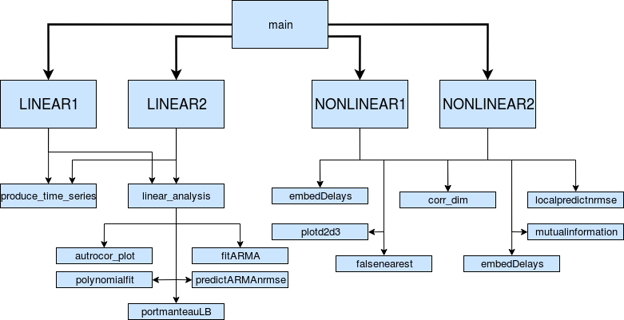

## Γραμμική ανάλυση 1ης χρονοσειράς

Η πρώτη χρονοσειρά που μας δίνεται όπως φαίνεται από το διαγραμμά της,
δε φαίνεται να κρύβει κάποια τάση π.χ. ανοδική. Οπότε, μάλλον ο ασθενής είναι υγιής (αυτό θα φανεί και αργότερα, αλλά χωρίς επαρκή ανάλυση δεν θα μπορούσαμε να υποστηρίξουμε κάτι τέτοιο). Επίσης, δε φαίνεται να είναι μόνο θόρυβος. Από αυτά εκτιμάμε ότι η χρονοσειρά εμπεριέχει πληροφορία για τον ασθενή. Στο Σχήμα [1] φαίνονται σε χρονική σειρά οι 6000 τιμές του σήματος που λάβαμε από το πρώτο πείραμα.

{ width=75% height=75% }


Μπορούμε να δούμε ότι από το βήμα 1000 μέχρι περίπου το βήμα 1200 το μάτι ξεγιελιέται αρκετά, ενώ λίγο μετά επανέρχεται. Για τις άλλες χρονικές στιγμές δε θα μπορούσαμε να πούμε κάτι ξεκάθαρο. Για αυτό και θα προχωρήσουμε στην ανάλυση του πειράματος με τα εργαλεία που έχουμε διδαχθεί στο μάθημα. Αρχικά θα πρέπει να παρουσιάσουμε.

### Εξαγωγή χρονοσειράς μελέτης

Με βάση τη συνάρτηση `extremes.m` που μας δόθηκε εξάγαμε όλες τις χρονοσειρές για τα τοπικά ακρότατα και τους χρόνους τους. Εκτός από τις δοκιμές για τις διάφορες παραμέτρους αυτής της συνάρτησης υλοποιήσαμε και δικά μας εργαλεία για να δούμε πρακτικά κατά πόσο η έξοδος της `extremes.m` είναι αποδεκτή. Πρώτα επειδή γνωρίζουμε ότι γίνεται χρήση ενός FIR φίλτρου και πάνω στην έξοδό του γίνεται η εύρεση των ακροτάτων θελήσαμε να εξετάσουμε την τάξη του φίλτρου. Για αυτό δοκιμάσαμε διάφορες τιμές από 5 έως 30 με βήμα 5 και καταλήξαμε ότι η τάξη 10 είναι αρκετά πιο υποσχόμενη.

#### Κώδικας ελέγχου τάξης φίλτρου :

```matlab
  b = ones(1,filterorder)/filterorder;
  xV = filtfilt(b,1,X1);
  LENGTH = length(X1);
  T = [1:LENGTH];
  if(FIR)
    hold on;
    plot(T, xV);
  end
```
Για επιπλέον έλεγχο της διαδικασίας δημιουργήσαμε διαγράμματα τα οποία εμφανίζουν τα ακρότατα πάνω στην αρχική χρονοσειρά ως καρφιά *jacks*.

#### Κώδικας εξαγωγής και ελέγχου του πίνακα ακροτάτων :

```matlab
  % extract time-series
  [locextM, ~] = extremes(X1, filterorder, nsam, 0.0, timesep, 0);
  extreme_time_idx = locextM(:,1);
  extrema_values = locextM(:,2);
  minimum_or_maximum = locextM(:,3);
    
  if(EXTREMA_PLOT) % need to have BASIC_PLOT=true to better work
    jacks = zeros(1, LENGTH);
    jacks(extreme_time_idx) = 40;
    jacks(extreme_time_idx -1) = -40;
    hold on;
    plot(T, jacks);
  end
```
Πέρα από τους ελέγχους οι τελικές χρονοσειρές ακρoτάτων της βασικής χρονοσειράς ΟΚΝ δίνεται από τον παρακάτω κώδικα:

#### Κώδικας εξαγωγής των ζητούμενων χρονοσειρών, από την έξοδο της `extremes.m` :

```matlab
  AMA = X1(extreme_time_idx);
  AMA = AMA(minimum_or_maximum == 1);
  AMI = X1(extreme_time_idx);
  AMI = AMI(minimum_or_maximum == -1);
  s = min(length(AMA), length(AMI));
  AMD = abs(AMA(1:s) - AMI(1:s));

  if(minimum_or_maximum(1) == 1) % first comes the maximum
    TMI = Ts * (extreme_time_idx(2:end) - extreme_time_idx(1:end-1));
    TMA = Ts * (extreme_time_idx(3:end) - extreme_time_idx(2:end-1));
  else % first comes the minimum
    TMI = Ts * (extreme_time_idx(3:end) - extreme_time_idx(2:end-1));
    TMA = Ts * (extreme_time_idx(2:end) - extreme_time_idx(1:end-1));
  end

  TBP = Ts * (extreme_time_idx .* (minimum_or_maximum + 1) ) /2.0;
  TBP = TBP(TBP > 0);
  TBP = TBP(2:end) - TBP(1:end-1);

  if (EXTREMA_SERIES_PLOT)
    f = figure();
    extrema_series_plot(1,3,1, AMA, 'AMA');
    extrema_series_plot(1,3,2, AMI, 'AMI');
    extrema_series_plot(1,3,3, AMD, 'AMD');

    saveas(f, sprintf('assets/AM_plot_%s.png', DST_NUM));
    f = figure();
    extrema_series_plot(1,3,1, TMA, 'TMA');
    extrema_series_plot(1,3,2, TMI, 'TMI');
    extrema_series_plot(1,3,3, TBP, 'TBP');
    saveas(f, sprintf('assets/TM_plot_%s.png', DST_NUM));    
  end
```

Από αυτές τις χρονοσειρές ενδιαφερόμαστε πιο πολύ για την χρονοσειρά `AMA` και την χρονοσειρά `TMI`. Μετά από έλεγχους για ύπαρξη πληροφορίας όπως Portmanteu καταλήξαμε ότι αυτές οι δύο έχουν την περισσότερη πληροφορία και προσεγγίζονται λιγότερο από λευκό θόρυβο. Στα σχήματα [2] και [3] δίνονται τα διαγράμματα των χρονοσειρών πλάτους και χρονικών περιθωρίων.


{ width=75% height=75% }


{ width=75% height=75% }

### Κυρίως γραμμική ανάλυση

#### AMA

Στο πρώτο μέρος της γραμμικής ανάλυσης θα αναφερθούμε στη χρονοσειρά AMA που εξάγαμε. Το πρώτο μέγεθος που υπολογίσαμε για αυτήν ήταν η τάση της. Αυτό το κάναμε χρησιμοποιώντας ένα πολυώνυμο. Το τελικό πολυώνυμο έδειξε ότι ο σταθερός όρος της τάσης είναι ίσος με `8.1121938` ενώ ο γραμμικός συντελεστής `0.2772935`. Οι υπόλοιποι 3 συντελεστές αυτού του πολυωνύμου βέβαια ακυρώνουν την γραμμική τάση μετά από λίγα χρονικά βήματα. Βέβαια για να απαλοίψουμε τη στοχαστική τάση χρησιμοποιήσαμε την απλή μέθοδο των διαφορών, αφού δεν υπήρχε και κάποια εποχικότητα.

#### Κώδικας απαλοιφής τάσεων

```matlab
if(REMOVES_TREND)
  [muyV, bV] = polynomialfit(yV, POLORDER);
  % save coefficients to a file
  save(sprintf('assets/polcoeff_%s_%s.txt', name, DST_NUM), 'bV', '-ascii');
  yV_detr = yV - muyV;
  if(REMOVES_TREND_PLOT)
    f = figure();
    subplot(1,2,1);
    plot(1:length(yV), yV);
    grid on;
    title(name);
    subplot(1,2,2);
    plot(1:length(yV_detr), yV_detr);
    grid on;
    title(sprintf('%s_detr', name));
    saveas(f, sprintf('rm_trend_%s_%s.png',name, DST_NUM));    
  end
  yV_detr = yV(2:end) - yV(1:end-1);  
end

```

Μετά υπολογίσαμε και κάναμε τα γραφήματα της συνάρτησης αυτοσυσχέτισης και μερικής αυτοσυσχέτισης. Στα σχήματα [4] και [5] φαίνονται τα διαγράμματα αυτά. Όπως μπορούμε να διακρίνουμε υπάρχουν σημαντικές αυτοσυσχετίσεις μέχρι και τη δεύτερη αυτοσυσχέτιση. Το ίδιο δέιχνουν και οι μερικές αυτοσυσχετίσεις, με κάποιες τιμές να είναι οριακά στατιστικά μηδενικές. Για αυτό και περιμένουμε τα μοντέλα να έχουν καλή προσέγγιση για χαμηλό βαθμό AR ή/και MA. 

{ width=75% height=75% }

{ width=75% height=75% }

#### Κώδικας για τον υπολογισμό των αυτοσυσχετίσεων

```matlab
if(AUTOCORR_PLOT)
  autrocor_plot(yV_detr, name);
  portmanteauLB(yV_detr, 20, 0.05, name);
end
```
```matlab
function autrocor_plot(yV, name)
  f = figure;
  autocorr(yV, 20); % 95% confidence lvls
  s = sprintf('autocorrelation of %s', name);
  title(s);
  saveas(f, sprintf('assets/autocorrelation_%s.%s', name, 'png'));
  % yVpac = acf2pacf(yVac, 1);
  f = figure;
  parcorr(yV, 20);
  s = sprintf('partial autocorrelations of %s', name)
  title(s);
  saveas(f, sprintf('assets/partial_autocorrelations_%s.%s',name,'png'));
end
```
Από τα παραπάνω καταλαβαίνουμε ότι αν χρησιμοποιήσουμε AR ή ARMA διαδικασίες για να εξηγήσουμε την συμπεριφορά της χρονοσειράς θα πρέπει το AR μέρος να έχει μέγιστο βαθμό περίπου 3. Προκειμένου να διαλέξουμε το κατάλληλο μοντέλο χρειάζεται πρώτα να πειραματιστούμε με έναν αριθμό υποψήφιων μοντέλων. Εφόσον αφαιρέσαμε την τάση και δεν βλέπουμε κάποιο άλλο είδος τάσης στις χρονοσειρές γνωρίζουμε ότι δεν έχει νόημα να χρησιμοποιήσουμε μοντέλα τύπου ARIMA με $I \neq 0$. Τώρα έχουμε διαλέξει τον χώρο αναζήτησης του βέλτιστου γραμμικού μοντέλου, το μόνο που χρειαζόμαστε ακόμα είναι το τελικό κριτήριο για την επιλογή του. Το τελικό κριτήριο επιλογής είναι το κριτήριο πληροφορίας Akaike με βάση το σφάλμα NRMSE. Στα παρακάτω διαγράμματα δείχνουμε τα κριτήρια αυτά για τα υποψήφια μοντέλα. Επίσης παρακάτω δίνουμε και το κομμάτι του κώδικα το οποίο δημιουργεί τα κριτήρια αυτά.


AIC για τα υποψήφια AR μοντέλα | AIC για τα υποψήφια MA μοντέλα
:-------------------------:|:-------------------------:
{ width=45% height=45% }  |  { width=45% height=45% } 

{ width=75% height=75% }

Αν και είπαμε πως το μοντέλο θα έχει μικρό βαθμό, ωστόσο συμπεριλαμβάνουμε και στα διαγράμματα μεγαλύτερους βαθμούς για να δούμε και να δείξουμε ακριβώς αυτό.

#### Κώδικας για τα AR μοντέλα

```matlab
function ar_estimate(yV, name, T, MAX_ORDER_AR)
  nlast = ceil(0.9 * length(yV));
  NRMSE = zeros(MAX_ORDER_AR,1);
  A = zeros(MAX_ORDER_AR,1);
  for i = 1: 1: MAX_ORDER_AR
    [n, ~, ~, ~, A(i), ~, ~] = fitARMA(yV(1:nlast), i, 0, T);
    NRMSE(i) = n(end);
  end
  f = figure;
  plot(NRMSE);
  grid on;
  s = sprintf('NRMSE of %s for AR process',  name);
  title(s);
  saveas(f, sprintf('assets/AR_NRMSE_%s.%s', name, 'png'));

  f = figure;
  plot(A);
  grid on;
  s = sprintf('Akaike criterion of %s for AR process',  name);
  title(s);
  saveas(f, sprintf('assets/AR_AIC_%s.%s', name, 'png'));
  % for best MA plot nrmse prediction error for T=1, T=2
  [m best_p] = min(A(1:min(MAX_ORDER_AR,10)));
  best_p = best_p(1)
  f = predictARMAnrmse(yV, best_p, 0, 2, nlast, 'prediction error for best AR');
  saveas(f, sprintf('assets/AR_best_pred_%s.%s', name, 'png'));
end
```

#### Κώδικας για τα ΜΑ μοντέλα

```matlab 
function ma_estimate(yV, name, T, MAX_ORDER_MA)
  nlast = ceil(0.9 * length(yV));
  NRMSE = zeros(1, MAX_ORDER_MA);
  A = zeros(1, MAX_ORDER_MA);
  for j = 1: 1: MAX_ORDER_MA
    [n, ~, ~, ~, A(j), ~, ~] = fitARMA(yV(1:nlast), 0, j, T);
    NRMSE(j) = n(end);
  end
  f = figure;
  plot(NRMSE);
  grid on;
  s = sprintf('NRMSE of %s for MA process', name);
  title(s);
  saveas(f, sprintf('assets/MA_NRMSE_%s.%s', name, 'png'));
  
  f = figure;
  plot(A);
  grid on;
  s = sprintf('Akaike criterion of %s for MA process', name);
  title(s);
  saveas(f, sprintf('assets/MA_AIC_%s.%s', name, 'png'));
  % for best MA plot nrmse prediction error for T=1, T=2
  [m best_q] = min(A(:));
  best_q = best_q(1)
  f = predictARMAnrmse(yV, 0, best_q, 2, nlast, 'prediction error for best MA');
  saveas(f, sprintf('assets/MA_best_pred_%s.%s', name, 'png'));
end
```

#### Κώδικας για τα ARMA μοντέλα

```matlab
function arma_estimate(yV, name, T, MAX_ORDER_AR, MAX_ORDER_MA)
  nlast = ceil(0.9 * length(yV));
  NRMSE = zeros(MAX_ORDER_AR, MAX_ORDER_MA);
  A = zeros(MAX_ORDER_AR, MAX_ORDER_MA);
  for i = 1: 1 : MAX_ORDER_AR
    for j = 1: 1 : MAX_ORDER_MA
      [n, ~, ~, ~, A(i,j), ~, ~] = fitARMA(yV(1:nlast), i, j, T);
      NRMSE(i,j) = n(end);
    end
  end
  % plot nrmse for arma
  f = figure;
  grid on;
  hold on;
  set(gca,'xtick',1:MAX_ORDER_AR);
  xlabel('order p');
  for j = 1: 1 : MAX_ORDER_MA
    plot([1:MAX_ORDER_AR], NRMSE(:,j), 'DisplayName', sprintf('(p,q) =(*,%d)', j));
  end
  legend('show');
  s = sprintf('NRMSE of %s for ARMA process', name);
  title(s);
  saveas(f, sprintf('assets/ARMA_NRMSE_%s.%s', name, 'png'));
  % plot aic for arma
  f = figure;
  grid on;
  hold on;
  set(gca,'xtick',1:MAX_ORDER_AR);
  xlabel('order p');      
  for j = 1: 1 : MAX_ORDER_MA
    plot([1:MAX_ORDER_AR], A(:,j), 'DisplayName', sprintf('(p,q) = (*,%d)', j));
  end
  legend('show');
  s = sprintf('Akaike criterion of %s for ARMA process', name);
  title(s);
  saveas(f, sprintf('assets/ARMA_AIC_%s.%s', name, 'png'));
  % for best ARMA plot nrmse prediction error for T=1, T=2
  B = A(1:min(10, MAX_ORDER_AR),1:min(3,MAX_ORDER_MA));
  [m n] = min(B(:));
  [best_p best_q] = ind2sub(size(B), n(1));
  f = predictARMAnrmse(yV, best_p, best_q, 2, nlast, 'prediction error for best ARMA');
  saveas(f, sprintf('assets/ARMA_best_pred_%s.%s', name, 'png'));
end
```

Από τα σχήματα του AIC για τα υποψήφια μοντέλα, παρατηρούμε ότι το μοντέλο `AR(2)` παρουσιάζει τη μικρότερη τιμή του AIC. Αυτό σημαίνει ότι θα διαλέξουμε το μοντέλο `AR(2)` για να εξηγήσουμε τη συμπεριφορά αυτής της χρονοσειράς. Τέλος για αυτό το μοντέλο δίνουμε το διάγραμμα που παρουσιάζει κατά πόσο μπορεί να προβλέψει μελλοντικές τιμές της εισόδου.

{ width=75% height=75% }

Από τα σφάλματα NRMSE βλέπουμε ότι οι προβλέψεις είναι κακές τόσο για βήμα T=1 όσο και για T=2. Για αυτό και η πρόβλεψη με χρήση της μέσης τιμής δίνει καλύτερα αποτελέσματα.

#### TMI

Παρακάτω πραγματοποιούμε τα ίδια βήματα για τη χρονοσειρά `TMI`. Επειδή ο κώδικας είναι γραμμένος όλος σε συναρτήσεις σύμφωνα με τα πρότυπα του δομημένου προγραμματισμού, το μόνο που θα έπρεπε να αλλάξουμε είναι οι παραμέτροι με τους οποίους μελετάμε τη χρονοσειρά. Πρακτικά για να γίνει η γραμμική ανάλυση της χρονοσειράς `TMI` καλούμε:

```matlab
linear_analysis(TMI, 'TMI1', MAX_ORDER_AR, MAX_ORDER_MA, POLORDER, ...
                EXTREMA_PLOT, EXTREMA_SERIES_PLOT, REMOVES_TREND, ...
                REMOVES_TREND_PLOT, AUTOCORR_PLOT, AKAIKE, DST_NUM);
```

Το πολυώνυμο που προσσεγγίζει την χρονοσειρά για τη μετέπειτα αφάρεση της τάσης έχει δύο τελευταίους όρους ίσους με:

- γραμμικός: $8.2051972\times 10^{-3}$ 
- σταθερός: $0.32034691$

Επίσης δε φαίνεται να έχει εποχικότητα για να χρειαστεί η μέθοδος των μεγάλων διαφορών. Βέβαια, πάλι χρησιμοποιούμε απλές διαφορές για να απαλοίψουμε και τη στοχαστική τάση.

{ width=75% height=75% }

{ width=75% height=75% }

Οι συναρτήσεις αυτοσυσχέτισης και μερικής αυτοσυσχέτισης δείχνουν ότι υπάρχει μία αρκετά ισχυρή σχέση της τωρινής τιμής της χρονοσειράς με πολλές προηγούμενες, ώστε αυτή η σχέση να θεωρηθεί σημαντική. Αυτό είναι προβληματικό για την αναλυσή μας τουλάχιστον στο γραμμικό κομμάτι, διότι η χρονοσειρά δεν έχει αρκετό πλήθος σημείων, ώστε να μπορέσουμε να εφαρμόσουμε τόσο μεγάλα μοντέλα. Παρόλα αυτά παρακάτω μελετάμε τη συμπεριφορά των μοντέλων που μας επιτρέπει το πλήθος σημείων της χρονοσειράς να δημιουργήσουμε.

AIC για τα υποψήφια AR μοντέλα | AIC για τα υποψήφια MA μοντέλα
:-------------------------:|:-------------------------:
{ width=45% height=45% }  |  { width=45% height=45% } 

{ width=75% height=75% }


{ width=75% height=75% }

H πρόβλεψη είναι καλύτερη από τη μέση τιμή για T=1 και χειρότερη στο T=2. Γενικά καταλήγουμε πως αυτή η μέθοδος μελέτης ακροτάτων για αυτή τη χρονοσειρά μπόρεσε να παράξει αποτελέσματα, αλλά όχι τόσο άξια για να πούμε ότι αντιπροσωπεύουν το μοντέλο. Αυτό βέβαια δε σημαίνει πως η μελέτη μας σταμάτησε εδώ. Στο δεύτερο κομμάτι της εργασίας θα προσπαθήσουμε να κάνουμε μία μη γραμμική ανάλυση της χρονοσειράς και να εξάγουμε αποτελέσματα για τη συμπεριφορά της.

## Γραμμική ανάλυση 2ης χρονοσειράς

Η δεύτερη χρονοσειρά όπως φαίνεται από το διαγραμμά της φαίνεται ότι έχει κάποια ανοδική τάση. Οπότε μάλλον ο ασθενής εδώ ξεγιελιέται και πρόκειται πραγματικά για ασθενή (αυτό θα φανεί και αργότερα, αλλά χωρίς επαρκή ανάλυση δεν θα μπορούσαμε να υποστηρίξουμε κάτι τέτοιο). Επίσης, σίγουρα δεν υπάρχει μόνο θόρυβος. Από αυτά εκτιμάμε ότι η χρονοσειρά έχει πληροφορία που χαρακτηρίζει τον ασθενή. Στο Σχήμα [12] φαίνονται σε χρονική σειρά οι 6000 τιμές του σήματος που λάβαμε από το δεύτερο πείραμα.

{ width=75% height=75% }

Όπως φαίνεται σε αυτή τη χρονοσειρά ο ασθενής συνεχώς ξεγιελιέται και σπάνια (3 φορές) επανέρχεται, αλλά και πάλι όχι πλήρως. Δηλαδή το μάτι δεν παίρνει την ίδια θέση που είχε πριν. Στο υπόλοιπο της γραμμικής μελέτης αυτής της χρονοσειράς, χρησιμοποιούμε τα εργαλεία του μαθήματος και συγκρίνουμε τη μελέτη με αυτή της πρώτης.

### Εξαγωγή χρονοσειράς μελέτης

Με βάση τη συνάρτηση `extremes.m` που μας δόθηκε εξάγαμε και πάλι όλες τις χρονοσειρές των τοπικών ακροτάτων που μπορεί κανείς να τις δει στα Σχήματα [13] και [14]. Επίσης, δίνονται και τα ορίσματα της συνάρτησης `extremes` τα οποία εξάγαμε μετά από αρκετό πειραματισμό.

```matlab
filterorder = 5;
nsam = 5;
timesep = 5;
``` 
Όπως και στην πρώτη χρονοσειρά, έτσι και εδώ ενδιαφερόμαστε περισσότερο για τις χρονοσειρές `AMA` και `TMI`. Μετά από ελέγχους ύπαρξης πληροφορίας Portmanteu καταλήγουμε και πάλι ότι αυτές οι δύο έχουν πληροφορία και δεν προσεγγίζονται μόνο από τον λευκό θόρυβο.

{ width=75% height=75% }


{ width=75% height=75% }

### Κυρίως γραμμική ανάλυση

#### AMA

Στο πρώτο μέρος της γραμμικής ανάλυσης θα αναφερθούμε στη χρονοσειρά AMA που εξάγαμε. Το πρώτο μέγεθος που υπολογίσαμε για αυτήν ήταν η τάση της. Αυτό το κάναμε χρησιμοποιώντας πάλι ένα πολυώνυμο. Το τελικό πολυώνυμο έδειξε ότι η σταθερός όρος της τάσης είναι ίσος με `-7.7080776`ενώ ο γραμμικός συντελεστής της `0.33391515`. Οι υπόλοιποι 3 συντελεστές αυτού του πολυωνύμου ωστόσο δεν ακυρώνουν την γραμμική τάση μετά από λίγα χρονικά βήματα όπως στην πρώτη χρονοσειρά. Δηλαδή επιβεβαιώνουν την ύπαρξη ανοδικής τάσης.

Μετά υπολογίσαμε και κάναμε τα γραφήματα της συνάρτησης αυτοσυσχέτισης και μερικής αυτοσυσχέτισης. Στα σχήματα [15] και [16] φαίνονται τα διαγράμματα αυτά.

{ width=75% height=75% }

{ width=75% height=75% }

Από τις αυτοσυσχετίσεις βλέπουμε ότι τα δεδομένα έχουν έμμεση συσχέτιση μέχρι και μεγάλες τιμές του $\tau$. Ωστόσο, οι μερικές αυτοσυσχετίσεις δείχνουν ότι οι μακρινές (σε χρονικά βήματα) τιμές δεν είναι άμεσα συσχετιζόμενες με την τωρινή. Αυτή είναι και μία μεγάλη ομοιότητα μεταξύ αυτής της AMA χρονοσειράς και της πρώτης AMA χρονοσειράς. Η πρώτη φαινόταν να έχει πιο ισχυρές πρώτες μερικές αυτοσυσχετίσεις και αυτοσυσχετίσεις.

Παρόλα αυτά τα γραμμικά μοντέλα μπορούν να πετύχουν τα παρακάτω. Το τελικό κριτήριο επιλογής αυτών είναι πάλι το AIC με βάση το σφάλμα NRMSE. Στα διαγράμματα [17] δείχνουμε τα κριτήρια αυτά για τα υποψήφια μοντέλα. 

AIC για τα υποψήφια AR μοντέλα | AIC για τα υποψήφια MA μοντέλα
:-------------------------:|:-------------------------:
{ width=45% height=45% }  |  { width=45% height=45% } 
---
{ width=75% height=75% }

Από τα σχήματα του AIC για τα υποψήφια μοντέλα, παρατηρούμε ότι το μοντέλο `AR(2)` παρουσιάζει τη μικρότερη τιμή του AIC. Αυτό σημαίνει ότι θα διαλέξουμε το μοντέλο `AR(2)` για να εξηγήσουμε τη συμπεριφορά αυτής της χρονοσειράς. Αυτό είναι ακριβώς το μοντέλο που χρησιμοποιήσαμε και στην πρώτη χρονοσειρά. Τέλος για αυτό το μοντέλο δίνουμε το διάγραμμα που παρουσιάζει κατά πόσο μπορεί να προβλέψει μελλοντικές τιμές της εισόδου.

{ width=75% height=75% }

Από τα σφάλματα NRMSE βλέπουμε ότι οι προβλέψεις είναι καλύτερες για βήμα T=1 από ότι για T=2. Για T=1 προτιμούμε το μοντέλο `AR(2)` ενώ για T>2 προτιμούμε τη μέση τιμή. Οι επιδόσεις του σε αυτή τη χρονοσειρά είναι σαφώς ανώτερες αυτές της πρώτης.

#### TMI

Η ανάλυση αυτής της εξαγόμενης χρονοσειράς γίνεται όπως και στην αντίστοιχη της πρώτης. Ωστόσο, πάλι δε θα παρουσιαστεί ο κώδικας γιατί όπως έχει υπωθεί είναι ο ίδιος για όλα τα κομμάτια με διαφορά στις παραμέτρους, γιατί γράφτηκε σύμφωνα με τα πρότυπα του δομημένου προγραμματισμού.

Το πολυώνυμο που προσεγγίζει την χρονοσειρά για τη μετέπειτα αφαίρεση της τάσης έχει δύο τελευταίους όρους ίσους με:
- γραμμικός: $4.6583853\times 10^{-5}$
- σταθερός: $0.131$ 


Επίσης, δε φαίνεται να έχει εποχικότητα για να χρειαστεί η μέθοδος των διαφορών.
Τα διαγράμματα που προκύπτουν είναι τα εξής:

{ width=75% height=75% }

{ width=75% height=75% }

Οι συσχετίσεις για αρκετές παρελθοντικές τιμές είναι ισχυρές σύμφωνα με τη συνάρτηση αυτοσυσχέτισης, όπως και οι μερικές αυτοσυσχετίσεις. Αυτό είναι παρόμοιο με την TMI της πρώτης χρονοσειράς. Μόνο που στην TMI της πρώτης χρονοσειράς πολλές μερικές αυτοσυσχετίσεις ήταν στο όριο να θεωρουθούν στατιστικά ασήμαντες. Το μοντέλο που περιγράφει αυτή τη χρονοσειρά καλύτερα φαίνεται παρακάτω στα σχήματα, όπως φαίνονται και τα κριτήρια με τα οποία το εξάγαμε.


AIC για τα υποψήφια AR μοντέλα | AIC για τα υποψήφια MA μοντέλα
:-------------------------:|:-------------------------:
{ width=45% height=45% }  |  { width=45% height=45% } 
---
{ width=75% height=75% }


{ width=75% height=75% }

Παραδόξως όμως η πρόβλεψη είναι καλύτερη από ότι αν είχαμε πρόβλεψη χρησιμοποιώντας τη μέση τιμή ακόμα και στα δύο χρονικά βήματα. Αυτό δείχνει ότι το μοντέλο `ARMA(2,3)` προσεγγίζει σχετικά καλά την χρονοσειρά. Επίσης είναι καλύτερη από ότι η αντίστοιχη καλύτερη στην πρώρη χρονοσειρά.

Ο κώδικας του αρχείου `LINEAR2.m` για την υλοποίηση της ανάλυσης της δεύτερης χρονοσειράς δίνεται παρακάτω:


Ο κώδικας του αρχείου `LINEAR2.m`:

```matlab
DST_NUM = '2nd';
if(BASIC_PLOT)
    f = figure();
    plot(T, X2);
    saveas(f, sprintf('assets/basic_plot_%s.png', DST_NUM));
    title(sprintf('%s time series', DST_NUM));
    xlabel('time-step');
    ylabel('eye-position');       
end
% see if the signal has information
% if voids and non-voids exist inside it
% then there is information.
% plot(T, log(abs(X1) + eps));
% Y1 = log(abs(X1(2:end))) - log(abs(X1(1:LENGTH-1)));
% plot(T(1:end-1), Y1)

filterorder = 5;
% we tested 30, 20, 10, 5
% 5 is much more promising...
nsam = 5;
timesep = 5;
% get EXTREMA SERIES 
[AMA, AMI, AMD, TMA, TMI, TBP] = produce_time_series(X2, Ts, filterorder, nsam, timesep, EXTREMA_PLOT, EXTREMA_SERIES_PLOT, FIR, DST_NUM);

% all linear analysis for AMA
linear_analysis(AMA, 'AMA2', MAX_ORDER_AR, MAX_ORDER_MA, POLORDER, ...
                EXTREMA_PLOT, EXTREMA_SERIES_PLOT, REMOVES_TREND, REMOVES_TREND_PLOT, AUTOCORR_PLOT, AKAIKE, DST_NUM);


% all linear analysis for TMI
linear_analysis(TMI, 'TMI2', MAX_ORDER_AR, MAX_ORDER_MA, POLORDER, ...
                EXTREMA_PLOT, EXTREMA_SERIES_PLOT, REMOVES_TREND, REMOVES_TREND_PLOT, AUTOCORR_PLOT, AKAIKE, DST_NUM);
```

## Μη-γραμμική ανάλυση 1ης χρονοσειράς

Σε αυτό το σημείο της εργασίας, αναλύουμε με μη γραμμικές μεθόδους την πρώτη χρονοσειρά. Όπως έδειξε η προηγούμενη ανάλυση το μοντέλο δεν μπόρεσε να εξηγηθεί με βάση τα γραμμικά εργαλεία. Οπότε, προχωράμε στη μη γραμμική μελέτη αυτής.

Στα πρώτα βήματα δε θα χρειαστεί να εξάγουμε κάποια άλλη χρονοσειρά μέσω της βασικής, ωστόσο θα πρέπει να βρούμε την υστέρηση και τη διάσταση εμβύθισης μέσω της μεθόδου των υστερήσεων. Για να έχουμε μια εποπτεία για τα μη γραμμικά μεγέθη της χρονοσειράς κάνουμε διαγράμματα διασποράς στις δύο και στις τρεις διαστάσεις. Τα διαγράμματα αυτά φαίνονται στα παρακάτω σχήματα:

 Διαγράμματα | Διασποράς 
:-------------------------:|:-------------------------:
{ width=45% height=45% } | { width=45% height=45% }
{ width=45% height=45% } | { width=45% height=45% }


Τα διαγράμματα διασποράς δε μας δίνουν μία τόσο καθαρή εικόνα ή μας βοηθούν για την διερεύνηση κατάλληλων παραμέτρων ανακατασκευής του χώρου κατάστασης στη συγκεκριμένη χρονοσειρά. Για αυτό προχωρούμε στη χρήση του διαγράμματος συνάρτησης αμοιβαίας πληροφορίας.

{ width=75% height=75% }

Αν η χρονοσειρά μπορούσε να εξηγηθεί από μη-γραμμική μοντελοποίηση, τότε η συνάρτηση αμοιβαίας πληροφορίας θα έπρεπε να παρουσιάζει ένα τοπικό ελάχιστο. Παρόλα αυτά στο διάγραμμα δε διακρίνεται κάποιο τοπικό ελάχιστο, αλλά μόνο ότι η συνάρτηση είναι φθίνουσα. Για να σιγουρευτούμε περί αυτού και να δούμε αν μπορούμε να συνεχίσουμε την μη γραμμική ανάλυση κάνουμε και επιπλέον διαγράμματα 2 διαστάσεων για πιο μεγάλους χρόνους υστέρησης. Αυτά φαίνονται στα παρακάτω σχήματα:

 Διαγράμματα               |Διασποράς  | 
:-------------------------:|:-------------------------:|:-------------------------:
{ width=30% height=30% } | { width=30% height=30% } | { width=30% height=30% }
{ width=30% height=30% } | { width=30% height=30% } | { width=30% height=30% }
{ width=30% height=30% } | { width=30% height=30% } | { width=30% height=30% }

Από αυτά καταλαβαίνουμε πως η μη-γραμμική ανάλυση που θα πραγματοποιήσουμε στη συνέχεια, πολύ πιθανόν να αποτύχει. Για την επιλογή του $\tau$ παίρνουμε την τιμή που η $I(\tau)$ κάνει αγκώνα. Δηλαδή $\tau=10$. 

Στη συνέχεια κάνουμε και άλλα διαγράμματα για να δείξουμε τη διάσταση εμβύθισης. Από ότι παρατηρούμε βέβαια δεν υπάρχει κάποιος ελκυστής ο οποίος να έχει κάποιο συγκεκριμένο σχήμα. Για να δούμε καλύτερα ότι υπάρχει ελκυστής και που ακριβώς είναι τοποθετημένος στα διαγράμματα χρησιμοποιούμε τη μέθοδο των ψευδών γειτόνων. 

{ width=75% height=75% }

Διαγράμματα  | Διασποράς |
:-------------------------:|:-------------------------:|:-------------------------:
{ width=45% height=45% } | { width=45% height=45% }
{ width=75% height=75% }


Τελικά, διαλέγουμε διάσταση εμβύθισης $m=3$ χρησιμοποιώντας τη μέθοδο των υστερήσεων και όχι τους ψευδείς γείτονες. Αυτό γίνεται γιατί παρόλο που οι ψευδείς γείτονες απαιτούν $m\geq 5$, όταν βάζουμε $m>3$ στα διαγράμματα διασποράς τα σημεία απλώνονται περισσότερο στον χώρο. Για να επαληθεύσουμε την επιλογή μας πραγματοποιούμε και υπολογισμό της διάστασης συσχέτισης για διαφορετικές 
διαστάσεις εμβύθισης και κατάλληλη παράμετρο υστέρησης (για τώρα $\tau=10$). Η διάσταση συσχέτισης προκύπτει να είναι μία ευθεία για τις πρώτες 7 τιμές του $m$ και μετά μία άλλη ευθεία για την οποία όμως υπάρχει μεγάλη ασάφεια για τις ακριβείς τιμές για την τιμή της $v$. Δηλαδή στη δεύτερη ευθεία $v = v\pm \delta , \delta \geq 0$. Η πρώτη ευθεία δείχνει την ύπαρξη χάους στη χρονοσειρά πάντα δεδομένου των $tau$ και $m$.


{ width=75% height=75% }

Το μόνο που μένει να κάνουμε ακόμα στο μοντέλο αυτής της χρονοσειράς είναι να δούμε την προβλεπτική του ικανότητα. Αυτή θα τη δούμε χρησιμοποιώντας κάποιο κατάλληλο τοπικό μοντέλο που βασίζεται σε κοντινότερους γείτονες. Η πρόβλεψη γίνεται για 1 έως και 10 βήματα μπροστά στο Σχήμα [23] χρησιμοποιώντας τους 3 κοντινότερους γείτονες. Ως σφάλμα πρόβλεψης χρησιμοποιούμε το NRMSE, ώστε να μπορέσουμε να συγκρίνουμε και με τα γραμμικά μοντέλα.


{ width=75% height=75% }

Αν και στην αρχή ήμασταν διστακτικοί για τα αποτελέσματα της μη γραμμικής ανάλυσης,
τα αποτελέσματα δείχνουν να είναι σίγουρα καλύτερα από ότι η γραμμική ανάλυση αυτής της χρονοσειράς. Βέβαια, στην γραμμική περίπτωση ουσιαστικά αναλύαμε μία σειρά τοπικών ακροτάτων. Ενώ στην πρώτη η πρόβλεψη αποτύγχανε να βρει το πλάτος για τη σειρά και μπορούσε να βρει μόνο τα χρόνο εμφάνισης του ακρότατου για T=1 με αρκετά υψηλό σφάλμα, εδώ η πρόβλεψη μπορεί να βρει ουσιαστικά και τα δύο με τουλάχιστον υποτετραπλάσιο σφάλμα για T=1. Επίσης, η πρόβλεψη είναι καλύτερη από την χρήση μέσης τιμής για μέχρι και 6 βήματα. Ο ασθενής σε αυτή την περίπτωση φαίνεται να είναι ασθενής λόγω των μικρών τιμών της διάστασης υστέρησης σε σχέση με τη δεύτερη χρονοσειρά(θα δειχθεί παρακάτω) και το σύστημα είναι χαμηλής διάστασης και μικρής πολυπλοκότητας ($m=3$, $k=3$, $q=1$), ωστόσο το ότι δεν παρουσιάζει τοπικό ελάχιστο στη συνάρτηση αμοιβαίας πληροφορίας δείχνει ???????. 

### Ο κώδικας μη-γραμμικής ανάλυσης της 1ης χρονοσειράς

```matlab
TS_NUM = '1st'; % '2nd'
xV = X1;

m_max = 6; % this is precalculated by seeing the various scatter plots

xM = embedDelays(xV, m_max, 1);
if(SCATTER_DIAGRAMS_PLOT)
  f = plotd2d3(xM(:,1:3),...
               sprintf('Multi dimensional scatter-diagrams for %s time series',...
               TS_NUM));
  saveas(f, sprintf('assets/scatter_%s_xM_1_2_3.png', TS_NUM));
  f = plotd2d3(xM(:,1:4),...
               sprintf('Multi dimensional scatter-diagrams for %s time series',...
               TS_NUM));
  saveas(f, sprintf('assets/scatter_%s_xM_1_2_4.png', TS_NUM));
  f = plotd2d3(xM(:,1:5),...
               sprintf('Multi dimensional scatter-diagrams for %s time series',...
               TS_NUM));
  saveas(f, sprintf('assets/scatter_%s_xM_1_2_5.png', TS_NUM));
  f = plotd2d3(xM,...
               sprintf('Multi dimensional scatter-diagrams for %s time series',...
               TS_NUM));
  saveas(f, sprintf('assets/scatter_%s_xM_1_2_6.png', TS_NUM));  
end
if(MORE_SCATTER_DIAGRAMS_PLOT)
  xM2 = embedDelays(xV, 10, 1);
  f = plotd2d3(xM2(:,1:2),...
              sprintf('Multi dimensional scatter-diagrams for %s time series tau = 1',...
              TS_NUM));
  title(sprintf('Multi dimensional scatter-diagrams for %s time series τ = 1', TS_NUM),...
        'Interpreter','latex');
  saveas(f, sprintf('assets/scatter_%s_xM_1_2.png', TS_NUM));
  f = plotd2d3([xM2(:,1) xM2(:,3)],...
              sprintf('Multi dimensional scatter-diagrams for %s time series tau = 2',...
              TS_NUM));
  title(sprintf('Multi dimensional scatter-diagrams for %s time series τ = 2', TS_NUM),...
        'Interpreter','latex');
  saveas(f, sprintf('assets/scatter_%s_xM_1_3.png', TS_NUM));
  f = plotd2d3([xM2(:,1) xM2(:,4)],...
              sprintf('Multi dimensional scatter-diagrams for %s time series tau = 3',...
              TS_NUM));
  title(sprintf('Multi dimensional scatter-diagrams for %s time series τ = 3', TS_NUM),...
        'Interpreter','latex');
  saveas(f, sprintf('assets/scatter_%s_xM_1_4.png', TS_NUM));
  f = plotd2d3([xM2(:,1) xM2(:,5)],...
              sprintf('Multi dimensional scatter-diagrams for %s time series tau = 4',...
              TS_NUM));
  title(sprintf('Multi dimensional scatter-diagrams for %s time series τ = 4', TS_NUM),...
        'Interpreter','latex');
  saveas(f, sprintf('assets/scatter_%s_xM_1_5.png', TS_NUM));
  f = plotd2d3([xM2(:,1) xM2(:,6)],...
              sprintf('Multi dimensional scatter-diagrams for %s time series tau = 5',...
              TS_NUM));
  title(sprintf('Multi dimensional scatter-diagrams for %s time series τ = 5', TS_NUM),...
        'Interpreter','latex');
  saveas(f, sprintf('assets/scatter_%s_xM_1_6.png', TS_NUM));
  f = plotd2d3([xM2(:,1) xM2(:,7)],...
              sprintf('Multi dimensional scatter-diagrams for %s time series tau = 6',...
              TS_NUM));
  title(sprintf('Multi dimensional scatter-diagrams for %s time series τ = 6', TS_NUM),...
        'Interpreter','latex');
  saveas(f, sprintf('assets/scatter_%s_xM_1_7.png', TS_NUM));
  f = plotd2d3([xM2(:,1) xM2(:,8)],...
              sprintf('Multi dimensional scatter-diagrams for %s time series tau = 7',...
              TS_NUM));
  title(sprintf('Multi dimensional scatter-diagrams for %s time series τ = 7', TS_NUM),...
        'Interpreter','latex');
  saveas(f, sprintf('assets/scatter_%s_xM_1_8.png', TS_NUM));
  f = plotd2d3([xM2(:,1) xM2(:,9)],...
              sprintf('Multi dimensional scatter-diagrams for %s time series tau = 8',...
              TS_NUM));
  title(sprintf('Multi dimensional scatter-diagrams for %s time series τ = 8', TS_NUM),...
        'Interpreter','latex');
  saveas(f, sprintf('assets/scatter_%s_xM_1_9.png', TS_NUM));
  f = plotd2d3([xM2(:,1) xM2(:,10)],...
              sprintf('Multi dimensional scatter-diagrams for %s time series tau = 9',...
              TS_NUM));
  title(sprintf('Multi dimensional scatter-diagrams for %s time series τ = 9',TS_NUM),...
        'Interpreter','latex');
  saveas(f, sprintf('assets/scatter_%s_xM_1_10.png', TS_NUM));    
end


% find best tau by using mutual information criterion
best_tau = 10;
if(FIND_BEST_TAU)
  tmax = 100;
  [mutM,f] = mutualinformation(xV, tmax);
  saveas(f, sprintf('assets/mutualinformation_%s.png', TS_NUM));
  best_tau = 10; % there is no local minimum so we choose a
                 % bending point
end
tau = best_tau;

xM = embedDelays(xV, m_max, tau);
if(SCATTER_DIAGRAMS_PLOT)
  m = 0;
  f = plotd2d3(xM(:,1:2),...
               sprintf('scatter-diagrams (tau=%d) for %s time series',...
               tau, TS_NUM));
  saveas(f, sprintf('assets/scatter_%s_with_tau_xM_1_2.png', TS_NUM));
  f = plotd2d3(xM(:,1:3),...
              sprintf('scatter-diagrams (tau=%d) for %s time series',...
              tau, TS_NUM));
  saveas(f, sprintf('assets/scatter_%s_with_tau_xM_1-3.png', TS_NUM));
  f = plotd2d3([xM(:,1), xM(:,4)],...
               sprintf('scatter-diagrams (tau=%d) for %s time series,lag=3',...
               tau, TS_NUM));
  saveas(f, sprintf('assets/scatter_%s_with_tau_xM_1_4.png', TS_NUM));    
end

if(FALSE_NEAREST_CALC_PLOT)
  m_max = 10;
  [fnnM,mdistV,sddistV,f] = falsenearest(xV, tau, m_max, 10, 0,...
                              sprintf('FNN for %s time-series',...
                              TS_NUM));
  saveas(f, sprintf('assets/false_nearest_calc_plot_%s.png', TS_NUM));
end

% Noise is the same for every plot, so it is not corelated with the input time series
% it is white noise because n --> +infty => Normalized distribution of noise.
% Its deviation is the same through the sample time.
if(DBSCAN_CLUSTERING)
    epsilon=0.5;
    MinPts=10;
    IDX=DBSCAN(xM,epsilon,MinPts);
    %% Plot Results
    f = figure();
    subplot(2,1,1);
    PlotClusterinResult(xM(:,1:3), IDX);
    title(['DBSCAN Clustering (m=' 3 ', \epsilon = ' num2str(epsilon) ', MinPts = ' num2str(MinPts) ')']);
    subplot(2,1,2);
    PlotClusterinResult(xM(:,1:4), IDX);
    title(['DBSCAN Clustering (m=' 4 ', \epsilon = ' num2str(epsilon) ', MinPts = ' num2str(MinPts) ')']);
    saveas(f, sprintf('assets/DBSCAN_%s.png', TS_NUM));
end


best_m = 3; % because when 4-th or 5-th dimension enter it causes catastrophy

% calculate correlation dimension
if(CALCULATE_CORRELATION_DIMENSION)
  mmax = 10;
  f = correlationdimension(xV, tau, mmax,' ');
  % [cor_dim,~,f] = corr_dim(xV, mmax, tau, PLOT_CORR_DIM);
  saveas(f, sprintf('assets/cor_dim_plot_%s.png', TS_NUM));
end


% train a local model
if(TRAIN_LOCAL_MODEL)
  k = 3; % stands for k in k-nn
  q = 1;
  Tmax = 10;
  [nrmseV,~,f] = localpredictnrmse(xV, TEST_SET_LENGTH, tau,...
                                   best_m, Tmax, k, 1,...
                                   'local-model-fit_1');
  saveas(f, sprintf('assets/local_model_fit_%s.png', TS_NUM));
end
```

## Μη-γραμμική ανάλυση 2ης χρονοσειράς

Σε αυτό το σημείο της εργασίας, αναλύουμε με μη γραμμικές μεθόδους τη δεύτερη χρονοσειρά. Στη γραμμική περίπτωση της δεύτερης χρονοσειράς καταφέραμε να εξάγουμε με επιτυχία ένα γραμμικό μοντέλο, αλλά όχι αρκετά ικανό για να περιγράψει πλήρως τη συμπεριφορά της χρονοσειράς.

Ούτε εδώ θα χρειαστεί να εξάγουμε κάποια άλλη χρονοσειρά μέσω της βασικής, ωστόσο θα πρέπει να βρούμε την υστέρηση και τη διάσταση εμβύθισης μέσω της μεθόδου των υστερήσεων. Όπως και στη μη γραμμική ανάλυση της πρώτης χρονοσειράς πρώτα κάνουμε τα διαγράμματα διασποράς. Αυτά φαίνονται στα παρακάτω σχήματα:

 Διαγράμματα | Διασποράς 
:-------------------------:|:-------------------------:
{ width=45% height=45% } | { width=45% height=45% }
{ width=45% height=45% } | { width=45% height=45% }

Και εδώ τα διαγράμματα αυτά δε μας δίνουν μία τόσο καθαρή εικόνα ή μας βοηθούν για την διερεύνηση κατάλληλων παραμέτρων ανακατασκευής του χώρου κατάστασης στη συγκεκριμένη χρονοσειρά. Οπότε, δοκιμάζουμε να κάνουμε περισσότερα και να δούμε εάν από αυτά μπορούμε να εξάγουμε την υστέρηση $\tau$.


 Διαγράμματα  | Διασποράς  |
:-------------------------:|:-------------------------:|:-------------------------:
{ width=30% height=30% } | { width=30% height=30% } | { width=30% height=30% }
{ width=30% height=30% } | { width=30% height=30% } | { width=30% height=30% }
{ width=30% height=30% } | { width=30% height=30% } | { width=30% height=30% }

Επειδή δε φαίνεται να μπορέσουμε να καταλήξουμε κάπου και επειδή μπορεί η υστέρηση να είναι αρκετά μεγάλη σε τιμή δοκιμάζουμε να κάνουμε το διάγραμμα της συνάρτησης αμοιβαίας πληροφορίας. Αυτό φαίνεται στο σχήμα [24].

{ width=75% height=75% }

Από το διάγραμμα της συνάρτησης αμοιβαίας πληροφορίας παρατηρούμε ότι το πρώτο τοπικό ελάχιστο είναι για υστέρηση $\tau =20$. Οπότε, αυτή είναι και η υστέρηση που θα χρησιμοποιήσουμε παρακάτω. Σε αντίθεση με την πρώτη χρονοσειρά αυτή έχει τοπικό ελάχιστο στη συνάρτηση αμοιβαίας πληροφορίας. Επιπλέον, θα χρειαζόμασταν πάνω από 20 διαγράμματα διασποράς για να καταλήξουμε στο ίδιο αποτέλεσμα.

Στη συνέχεια προχωράμε στην αναζήτηση της διάστασης εμβύθισης. Αρχικά για να τη βρούμε κάνουμε το διάγραμμα ψευδών γειτόνων. Αυτό φαίνεται στο σχήμα [25].

{ width=75% height=75% }

Σύμφωνα με το διάγραμμα ψευδών γειτόνων για $m=4$ παρουσιάζεται η πρώτη τιμή με FNN μικρότερο του 0.1, για αυτό και θα έπρεπε να διαλέξουμε αυτό. Ωστόσο, δεν αφήνουμε την ανάλυση μόνο στο διάγραμμα FNN, αλλά κάνουμε και τα διαγράμματα διασποράς για διάφορες τιμές του $m$ γύρω από το 4. 

Διαγράμματα  | Διασποράς
:-------------------------:|:-------------------------:
{ width=45% height=45% } | { width=45% height=45% }
{ width=75% height=75% }

Από τα τελευταία αυτά διαγράμματα διασποράς, βλέπουμε ότι η τιμή $m=3$ είναι καλύτερη, διότι ο ελκυστής για $m=2$ ή/και $m=4$ αρχίζει και καταστρέφεται. Το ίδιο επιβεβαιώνεται από τα διαγράμματα σφάλματος πρόβλεψης. Το σφάλμα πρόβλεψης δείχνει να έχει ένα τοπικό ελάχιστο για $m=3$. Αυτό το διάγραμμα θα το δείξουμε στο τέλος της μη-γραμμικής ανάλυσης.

Το επόμενο που κάναμε ήταν να δούμε τη διάσταση συσχέτισης. Όπως και πρωτύτερα κάνουμε τα σχετικά διαγράμματα με χρήση των πακέτων tisean.

{ width=75% height=75% }

Από το διάγραμμα της διάστασης συσχέτισης, μπορούμε εύκολα να επιλέξουμε το $m=3$ και να δούμε ότι εκεί παρουσιάζεται χάος και μικρό όριο σφάλματος. Επίσης, γίνεται κατανοητό ότι οι κλίσεις δε συγκλίνουν, αλλά αυξάνουν καθώς το $m$ αυξάνει και επομένως η εκτίμηση του $v$ αυξάνει με το $m$. Αυτό συμβαίνει γιατί το παράθυρο χρόνου της ανακατασκευής γίνεται πολύ μεγάλο και οι αναδιπλώσεις του ελκυστή καταστρέφουν την κλιμάκωση για μεγάλα $r$. Παρόλα αυτά για $m=3$ το μοντέλο είναι χαοτικό διότι το διάστημα στο οποίο βρίσκεται μέσα η $v$ δεν εμπεριέχει ακέραιο αριθμό.

Το μόνο που μένει να κάνουμε ακόμα στο μοντέλο αυτής της χρονοσειράς είναι να δούμε την προβλεπτική του ικανότητα. Αυτή θα τη δούμε χρησιμοποιώντας κάποιο κατάλληλο τοπικό μοντέλο που βασίζεται σε κοντινότερους γείτονες. Η πρόβλεψη γίνεται για 1 έως και 10 βήματα μπροστά στο Σχήμα [28] χρησιμοποιώντας τους 3 κοντινότερους γείτονες. Ως σφάλμα πρόβλεψης χρησιμοποιούμε το NRMSE, ώστε να μπορέσουμε να συγκρίνουμε και με τα γραμμικά μοντέλα, όπως και με τη μη γραμμική ανάλυση της δεύτερης χρονοσειράς.

{ width=75% height=75% }

Από ότι βλέπουμε τα αποτελέσματα πρόβλεψης είναι καλύτερα από ότι στη γραμμική ανάλυση. Αυτό συμβαίνει τόσο για T=1, όσο και για τα υπόλοιπα βήματα. Ωστόσο, οι μέθοδοι ανάλυσης ήταν αρκετά πιο ασαφής, διότι χρειάστηκε να χρησιμοποιήσουμε τη μέθοδο των υστερήσεων για τη μη γραμμική ανάλυση. Επιπλέον, αν και το αποτέλεσμα είναι ένα χαμηλο-διάστατο χαοτικό μοντέλο (ίδιο με το μη γραμμικό της πρώτης χρονοσειράς), είναι σίγουρα πιο πολύπλοκο από τα `AR(2)` και `ARMA(2,3)` που είχαμε στο γραμμικό κομμάτι της γραμμικής ανάλυσης της δεύτερης χρονοσειράς. Ωστόσο, η προβλεπτική ικανότητα μας οδηγεί να πούμε ότι το σύστημα μπορεί να μοντελοποιηθεί καλύτερα με ένα μη γραμμικό μοντέλο όπως αυτό και μάλιστα παρουσιάζει και χαοτική συμπεριφορά. Δυστυχώς, η προβλεπτική του ικανότητα είναι χειρότερη του πρώτου, αλλά είναι σημαντικό ότι παρουσιάζει μία ανοδική ευθεία στο διάγραμμα διάστασης συσχέτισης $v(m)$ και επιπλέον η συνάρτηση αμοιβαίας πληροφορίας παρουσιάζει ελάχιστο. Αυτά τα δύο τελευταία μας κάνουν να χαρακτηρίσουμε αυτό το σύστημα πιο εύκολα μη-γραμμικό από ότι αυτό της πρώτης χρονοσειράς. Οπότε, από όλη την ανάλυση της δεύτερης χρονοσειράς μπορούμε να πούμε ότι είναι ένα αιτιοκρατικό σύστημα, χαμηλής διάστασης και μικρής πολυπλοκότητας. 

Επιπλέον η μη-γραμμική δυναμική του συστήματος αυτού φαίνεται να είναι ασθενέστερη από ότι του πρώτου. Αυτό φαίνεται από την προβλεπτική ικανότητά του, η οποία είναι υποδεέστερη του πρώτου. Επίσης, από τη διάσταση συσχέτισης και από το σχετικό άρθρο που δόθηκε μπορούμε να πούμε πως αυτή η χρονοσειρά παρουσιάζει μεγαλύτερες τιμές διάστασης συσχέτισης οπότε αφορά τον υγιή άνθρωπο σε αντίθεση με την υπόθεσή μας αρχικά.

### Ο κώδικας μη-γραμμικής ανάλυσης της 2ης χρονοσειράς

```matlab
TS_NUM = '2nd'; % '2nd'
xV = X2;

m_max = 5; % this is precalculated by seeing the various scatter plots

xM = embedDelays(xV, m_max, 2);
if(SCATTER_DIAGRAMS_PLOT)
  f = plotd2d3(xM(:,1:3),...
               sprintf('Multi dimensional scatter-diagrams for %s time series',...
               TS_NUM));
  saveas(f, sprintf('assets/scatter_%s_xM_1_2_3.png', TS_NUM));
  f = plotd2d3(xM(:,1:4),...
               sprintf('Multi dimensional scatter-diagrams for %s time series',...
               TS_NUM));
  saveas(f, sprintf('assets/scatter_%s_xM_1_2_4.png', TS_NUM));
  f = plotd2d3(xM(:,1:5),...
               sprintf('Multi dimensional scatter-diagrams for %s time series',...
               TS_NUM));
  saveas(f, sprintf('assets/scatter_%s_xM_1_2_5.png', TS_NUM));
  f = plotd2d3(xM,...
               sprintf('Multi dimensional scatter-diagrams for %s time series',...
               TS_NUM));
  saveas(f, sprintf('assets/scatter_%s_xM_1_2_6.png', TS_NUM));  
end
if(MORE_SCATTER_DIAGRAMS_PLOT)
  xM2 = embedDelays(xV, 10, 1);
  f = plotd2d3(xM2(:,1:2),...
              sprintf('Multi dimensional scatter-diagrams for %s time series tau = 1',...
              TS_NUM));
  title(sprintf('Multi dimensional scatter-diagrams for %s time series τ = 1', TS_NUM),...
        'Interpreter','latex');
  saveas(f, sprintf('assets/scatter_%s_xM_1_2.png', TS_NUM));
  f = plotd2d3([xM2(:,1) xM2(:,3)],...
              sprintf('Multi dimensional scatter-diagrams for %s time series tau = 2',...
              TS_NUM));
  title(sprintf('Multi dimensional scatter-diagrams for %s time series τ = 2', TS_NUM),...
        'Interpreter','latex');
  saveas(f, sprintf('assets/scatter_%s_xM_1_3.png', TS_NUM));
  f = plotd2d3([xM2(:,1) xM2(:,4)],...
              sprintf('Multi dimensional scatter-diagrams for %s time series tau = 3',...
              TS_NUM));
  title(sprintf('Multi dimensional scatter-diagrams for %s time series τ = 3', TS_NUM),...
        'Interpreter','latex');
  saveas(f, sprintf('assets/scatter_%s_xM_1_4.png', TS_NUM));
  f = plotd2d3([xM2(:,1) xM2(:,5)],...
              sprintf('Multi dimensional scatter-diagrams for %s time series tau = 4',...
              TS_NUM));
  title(sprintf('Multi dimensional scatter-diagrams for %s time series τ = 4', TS_NUM),...
        'Interpreter','latex');
  saveas(f, sprintf('assets/scatter_%s_xM_1_5.png', TS_NUM));
  f = plotd2d3([xM2(:,1) xM2(:,6)],...
              sprintf('Multi dimensional scatter-diagrams for %s time series tau = 5',...
              TS_NUM));
  title(sprintf('Multi dimensional scatter-diagrams for %s time series τ = 5', TS_NUM),...
        'Interpreter','latex');
  saveas(f, sprintf('assets/scatter_%s_xM_1_6.png', TS_NUM));
  f = plotd2d3([xM2(:,1) xM2(:,7)],...
              sprintf('Multi dimensional scatter-diagrams for %s time series tau = 6',...
              TS_NUM));
  title(sprintf('Multi dimensional scatter-diagrams for %s time series τ = 6', TS_NUM),...
        'Interpreter','latex');
  saveas(f, sprintf('assets/scatter_%s_xM_1_7.png', TS_NUM));
  f = plotd2d3([xM2(:,1) xM2(:,8)],...
              sprintf('Multi dimensional scatter-diagrams for %s time series tau = 7',...
              TS_NUM));
  title(sprintf('Multi dimensional scatter-diagrams for %s time series τ = 7', TS_NUM),...
        'Interpreter','latex');
  saveas(f, sprintf('assets/scatter_%s_xM_1_8.png', TS_NUM));
  f = plotd2d3([xM2(:,1) xM2(:,9)],...
              sprintf('Multi dimensional scatter-diagrams for %s time series tau = 8',...
              TS_NUM));
  title(sprintf('Multi dimensional scatter-diagrams for %s time series τ = 8', TS_NUM),...
        'Interpreter','latex');
  saveas(f, sprintf('assets/scatter_%s_xM_1_9.png', TS_NUM));
  f = plotd2d3([xM2(:,1) xM2(:,10)],...
              sprintf('Multi dimensional scatter-diagrams for %s time series tau = 9',...
              TS_NUM));
  title(sprintf('Multi dimensional scatter-diagrams for %s time series τ = 9',TS_NUM),...
        'Interpreter','latex');
  saveas(f, sprintf('assets/scatter_%s_xM_1_10.png', TS_NUM));    
end

% find best tau by using mutual information criterion
best_tau = 20;
if(FIND_BEST_TAU)
  tmax = 100;
  [mutM,f] = mutualinformation(xV, tmax);
  saveas(f, sprintf('assets/mutualinformation_%s.png', TS_NUM));
  best_tau = 20; % there is the first local minimum
end
tau = best_tau;


xM = embedDelays(xV, m_max, tau);
if(SCATTER_DIAGRAMS_PLOT)
  m = 0;
  f = plotd2d3(xM(:,1:2), sprintf('scatter-diagrams (tau=%d) for %s time series', tau, TS_NUM));
  saveas(f, sprintf('assets/scatter_%s_with_tau_xM_1_2.png', TS_NUM));
  f = plotd2d3(xM(:,1:3), sprintf('scatter-diagrams (tau=%d) for %s time series', tau, TS_NUM));
  saveas(f, sprintf('assets/scatter_%s_with_tau_xM_1-3.png', TS_NUM));
  f = plotd2d3([xM(:,1), xM(:,4)], sprintf('scatter-diagrams (tau=%d) for %s time series,lag=3', tau, TS_NUM));
  saveas(f, sprintf('assets/scatter_%s_with_tau_xM_1_4.png', TS_NUM));    
end

if(FALSE_NEAREST_CALC_PLOT)
  m_max = 20;
  [fnnM,mdistV,sddistV,f] = falsenearest(xV, tau, m_max, 10, 0, sprintf('FNN for %s time-series', TS_NUM));
  saveas(f, sprintf('assets/false_nearest_calc_plot_%s.png', TS_NUM));
end

if(DBSCAN_CLUSTERING)
  epsilon=0.5;
  MinPts=10;
  IDX=DBSCAN(xM,epsilon,MinPts);
  %% Plot Results
  f = figure();
  subplot(2,1,1);
  PlotClusterinResult(xM(:,1:3), IDX);
  title(['DBSCAN Clustering (m=', 3,', \epsilon = ' num2str(epsilon) ', MinPts = ' num2str(MinPts) ')']);
  subplot(2,1,2);
  PlotClusterinResult(xM(:,1:4), IDX);
  title(['DBSCAN Clustering (m=', 4,', \epsilon = ' num2str(epsilon) ', MinPts = ' num2str(MinPts) ')']);
  saveas(f, sprintf('assets/DBSCAN_%s.png', TS_NUM));
end

best_m = 3; % because false nearest says so (FNN is below 0.1)


% calculate correlation dimension
if(CALCULATE_CORRELATION_DIMENSION)
  mmax = 10;
  f = correlationdimension(xV, tau, mmax,' ');
  saveas(f, sprintf('assets/cor_dim_plot_%s.png', TS_NUM));
end


% train a local model
if(TRAIN_LOCAL_MODEL)
  k = 3; % stands for k in k-nn
  q = 1;
  Tmax = 10;
  [nrmseV,~,f] = localpredictnrmse(xV, TEST_SET_LENGTH, tau, best_m, Tmax, k, 1,'local-model-fit_1');
  saveas(f, sprintf('assets/local_model_fit_%s.png', TS_NUM));
end
```

## Δομή της Εργασίας \& Τρόπος χρήσης

Η εργασία απαρτίζεται από πολλά κομμάτια. Έχουμε το κομμάτι των δεδομένων που βρίσκεται στο φάκελο data και αφορά τις χρονοσειρές που δίνονται για αυτή την εργασία. Παράλληλα δίνουμε και ένα script το οποίο κατεβάζει τις χρονοσειρές. Το κομμάτι της γραπτής αναφοράς βρίσκεται στον φάκελο doc. Τα δεδομένα που εξάγουμε από τις χρονοσειρές βρίσκονται στο φάκελο assets. Όλα τα αρχεία κώδικα βρίσκονται στο φάκελο src. Επιπλέον υπάρχει ο φάκελος kdtree όπου έχει τις βιβλιοθήκες που χρειάζονται για τη μη γραμμική ανάλυση.

Πιο συγκεκριμένα ο τρόπος με τον οποίο καλείται ο κώδικας στη matlab είναι ο εξής:
1. Ο χρήστης χρειάζεται απλά να ορίσει ως αρχική διαδρομή αρχείου τη διαδρομή αρχείου που βρίσκεται η εργασία.
2. Γράφει  `main`  στην κονσόλα.

Το σκριπτάκι main φροντίζει να καλέσει όλα τα υπόλοιπα αρχεία, ώστε να γίνουν όλες οι αναλύσεις. Τέλος όλα τα αποτελέσματα θα γραφούν στον φάκελος assets, διαγράφοντας όλα τα προηγούμενα.




### Ο κώδικας του αρχείου `main.m`:

```matlab
addpath('src');
addpath('kdtree');
addpath('kdtree/src');
addpath('kdtree/lib');
system('rm assets/*');
clear all;
close all;

%%%%%%%%%%%%%%%% FLAGS %%%%%%%%%%%%%%%%
BASIC_PLOT                      = true;
FIR                             = true;
EXTREMA_PLOT                    = true;
EXTREMA_SERIES_PLOT             = true;
REMOVES_TREND                   = true;
REMOVES_TREND_PLOT              = true;
AUTOCORR_PLOT                   = true;
AKAIKE                          = true;


SCATTER_DIAGRAMS_PLOT           = false;
DBSCAN_CLUSTERING               = false;
FALSE_NEAREST_CALC_PLOT         = true;
FIND_BEST_TAU                   = true;
CALCULATE_CORRELATION_DIMENSION = true;
PLOT_CORR_DIM                   = true;
TRAIN_LOCAL_MODEL               = true;
%%%%%%%%%%%%%%%% Input time Series & globals %%%%%%%%%%%%%%%%
LENGTH                          = 6000;
TEST_SET_LENGTH                 = 500;
POLORDER                        = 4;
MAX_ORDER_AR                    = 20;
MAX_ORDER_MA                    = 3;
fs                              = 100; % Hz
Ts                              = 1.0 / fs; % seconds

% read series
fileID1 = fopen('data/dat6v1.dat', 'r');
fileID2 = fopen('data/dat6v2.dat', 'r');
X1 = cell2mat(textscan(fileID1, '%f'));
X2 = cell2mat(textscan(fileID2, '%f'));
T = [1:LENGTH];


%%%%%%%%%%%%%%%% Time Series 1 %%%%%%%%%%%%%%%%
LINEAR1
NONLINEAR1
%%%%%%%%%%%%%%%% Time Series 2 %%%%%%%%%%%%%%%%
LINEAR2
NONLINEAR2


%%%%%%%%%%%%%%%% auto crop all images %%%%%%%%%
% requires image magic
!mogrify -trim +repage assets/*.png
```